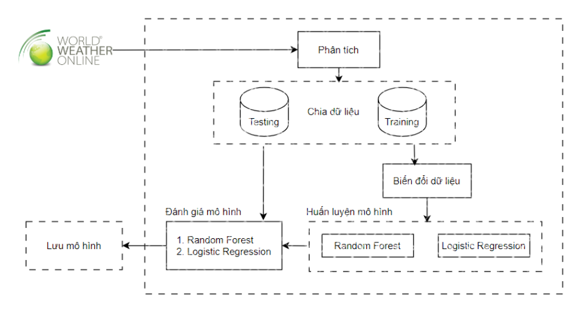
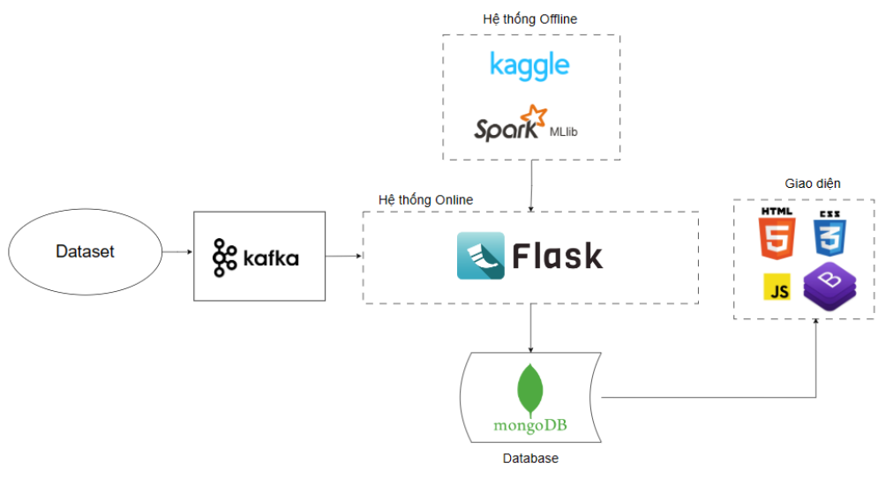

# BigData_Weather_Forecast

Weather Forecasting Project for Big Data Course - HUIT (Ho Chi Minh City University of Industry and Trade)

**Project:** Big Data Weather Forecasting System

This project uses Spark, Hadoop, and Kafka to input weather data into two trained models (Random Forest and Logistic Regression) to predict weather conditions (rain or no rain) and rainfall in real-time. The predictions are then displayed on a web interface.

## Prerequisites

```text
- Docker
- Docker Compose
- Jupyter Notebook (for training models and running producer)
```

## Quick Start with Docker

**Step 1: Configure Environment Variables**

Copy the example environment file and update with your credentials:

```bash
# Copy the example file
cp .env.example .env

# Edit .env with your preferred credentials
# Default values are provided for quick start
```

**Step 2: Start the Core System**

Start the core services (Kafka, MongoDB, Web App):

```bash
docker-compose up -d --build
```

This will start:
- Zookeeper (port 2181)
- Kafka (port 9092)
- MongoDB (port 27017)
- Web Application (port 5000)

Access the web interface at: `http://localhost:5000`

**Step 3: Start the Producer (Data Streaming)**

The producer sends weather data to Kafka. You have two options:

**Option A: Docker Service (Recommended)**
```bash
# Start producer in continuous mode (loops 100 records with 1s delay)
docker-compose --profile producer up -d

# Check producer logs
docker logs weather-producer -f
```

**Option B: Standalone Python Script**
```bash
# Quick test: Send 50 records
python producer/producer.py --records 50 --delay 0.1

# Continuous streaming: Loop 100 records forever
python producer/producer.py --continuous --records 100 --delay 1

# Send all records as fast as possible (takes ~4 hours)
python producer/producer.py --records all --delay 0
```

**Optional: Start Mongo Express (Database UI)**

```bash
docker-compose --profile ui up -d
```

Access Mongo Express at: `http://localhost:8081`

## Usage

The project has been developed and tested on Windows and Linux using Docker.

### 1. Export Model (Optional)

The project includes pre-trained models. However, if you want to retrain:

Run `weather-forecast.ipynb` and `rainfall-prediction.ipynb` in `machine_learning/notebooks` to export models.

- Models from `weather-forecast.ipynb` go to `webapp/app/models/weather`
- Models from `rainfall-prediction.ipynb` go to `webapp/app/models/amount_of_rain`

**Important:** After updating models, delete all `.crc` checksum files in the model directories before rebuilding Docker images.

```bash
# Example: Delete checksum files
Get-ChildItem -Path .\webapp\app\models -Filter "*.crc" -Recurse | Remove-Item
```

### 2. Configure Environment Variables (Already Done in Quick Start)

The `.env` file contains all configuration:

```env
# Application
PORT=5000
DEBUG=True

# Kafka
KAFKA_TOPIC_NAME=bigdata
KAFKA_BOOTSTRAP_SERVERS=kafka:29092
KAFKA_GROUP_ID=weather_group

# MongoDB
MONGO_HOST=mongodb
MONGO_PORT=27017
MONGO_USERNAME=admin
MONGO_PASSWORD=admin123
DB_NAME=weather_forecast
```

**Security Note:** Never commit `.env` to git! Use `.env.example` as template.

**Note:** When using Docker, use service names (`kafka`, `mongodb`) instead of `localhost`.

### 3. Producer Configuration

The producer supports various modes via command-line arguments:

```bash
# Quick test (50 records, 0.1s delay)
python producer/producer.py --records 50 --delay 0.1

# Continuous mode (loops 100 records forever, 1s delay)
python producer/producer.py --continuous --records 100 --delay 1

# Send all 135K records as fast as possible
python producer/producer.py --records all --delay 0

# Custom configuration
python producer/producer.py \
  --records 1000 \
  --delay 0.5 \
  --kafka localhost:9092 \
  --topic bigdata \
  --dataset ./machine_learning/dataset/weather_dataset.csv
```

**Docker Mode:**
```bash
# Start producer as Docker service
docker-compose --profile producer up -d

# View producer logs
docker logs weather-producer -f

# Stop producer
docker-compose --profile producer down
```

### 5. View Results

Access the web interface at `http://localhost:5000` to see real-time predictions.

### 6. Stop the System

```bash
# Stop all services
docker-compose down

# Stop and remove volumes (clears database)
docker-compose down -v
```

## Manual Setup (Without Docker)

If you prefer not to use Docker, follow these steps:

<details>
<summary>Click to expand manual setup instructions</summary>

### Requirements
- Python 3.10
- Java 11
- kafka_2.12-3.8.0
- MongoDB
- Hadoop 3.3.5 (winutils.exe and hadoop.dll for Windows in `dependencies/hadoop`)

### Steps

1. **Start MongoDB** (ensure it's running on port 27017)

2. **Start Kafka**
```bash
# Terminal 1: Start Zookeeper
bin\windows\zookeeper-server-start.bat config\zookeeper.properties

# Terminal 2: Start Kafka
bin\windows\kafka-server-start.bat config\server.properties
```

3. **Configure .env**
```env
KAFKA_BOOTSTRAP_SERVERS=localhost:9092
KAFKA_TOPIC_NAME=weather_topic
MONGO_HOST=localhost
MONGO_PORT=27017
DB_NAME=Weather-Forecast
```

4. **Install Python dependencies**
```bash
cd webapp
python -m venv venv
venv\Scripts\activate  # Windows
# source venv/bin/activate  # Linux/Mac
pip install -r requirements.txt
```

5. **Run Web Application**
```bash
python app.py
```

6. **Run Producer** (in separate terminal)
Open and run `machine_learning/notebooks/Weather_producer.ipynb`

</details>

## Machine Learning Models

### Data Source

Weather data is sourced from <https://www.worldweatheronline.com/>

The dataset contains **135,818 hourly weather records** from 2008-2020 with 28 features including temperature, humidity, wind speed, pressure, and precipitation.

### Models and Performance

The project uses two types of predictions:

1. **Weather Classification** (Rain vs No Rain)
   - Random Forest: **83.65% accuracy**
   - Logistic Regression: 81.40% accuracy
   
2. **Rainfall Amount Prediction** (mm)
   - Logistic Regression model
   - Predicts precipitation amount when rain is detected

### Training Process

Run the notebooks in `machine_learning/notebooks`:

- `weather-forecast.ipynb` - Trains weather classification models (Random Forest & Logistic Regression)
- `rainfall-prediction.ipynb` - Trains rainfall amount prediction models

Each notebook performs:
- Data preprocessing and feature engineering
- Model training with PySpark ML Pipeline
- Model evaluation and export

### Model Pipeline Components

Each model consists of a PySpark ML Pipeline with:
1. **StringIndexer** stages - Convert categorical features to numeric
2. **VectorAssembler** - Combine features into feature vector
3. **Classifier/Regressor** - Final prediction model (Random Forest or Logistic Regression)

### Updating Models

To retrain and update models:

1. Run the training notebooks to export new models
2. **Delete all `.crc` checksum files** in model directories
   ```bash
   Get-ChildItem -Path .\webapp\app\models -Filter "*.crc" -Recurse | Remove-Item
   ```
3. Rebuild Docker images
   ```bash
   docker-compose up --build
   ```

**Note:** Checksum files cause model loading errors when models are copied to Docker containers.

## Architecture

### System Flow

1. **Data Source** → Weather data from worldweatheronline.com
2. **Producer** → Jupyter Notebook sends data to Kafka topic
3. **Kafka** → Message broker for streaming data
4. **Consumer** → PySpark application consumes messages
5. **ML Models** → Random Forest & Logistic Regression predict weather
6. **MongoDB** → Stores predictions and raw data
7. **Flask Web App** → Displays results in real-time

### Docker Services

```yaml
zookeeper:2181  # Kafka coordination
kafka:9092      # Message streaming
mongodb:27017   # Data storage
webapp:5000     # Web interface
```

### Model Training Diagram



### System Architecture



### View Logs

```bash
# View all logs
docker-compose logs

# View specific service logs
docker-compose logs webapp
docker-compose logs kafka

# Follow logs in real-time
docker-compose logs -f
```

## Development

### Project Structure

```
Weather-Forecast/
├── docker-compose.yml          # Docker orchestration
├── Dockerfile                  # Webapp container definition
├── machine_learning/
│   ├── dataset/               # Training data (135K records)
│   ├── models/                # Trained models
│   └── notebooks/             # Training & producer notebooks
└── webapp/
    ├── app/
    │   ├── models/            # ML models for inference
    │   ├── controllers/       # Flask routes
    │   └── services/          # Prediction services
    ├── kafka_consumer/        # Kafka consumer
    ├── database/              # MongoDB connection
    └── templates/             # Web UI templates
```

### Technologies Used

- **Apache Spark 3.5.0** - Distributed ML inference
- **Apache Kafka 2.12-3.8.0** - Stream processing
- **MongoDB 7.0** - NoSQL database
- **Flask 3.0.1** - Web framework
- **PySpark ML** - Machine learning pipeline
- **Docker & Docker Compose** - Containerization

